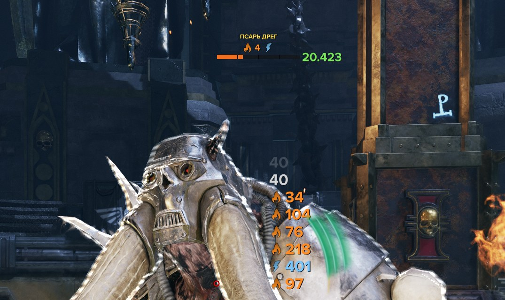
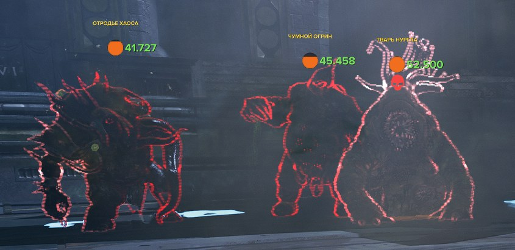
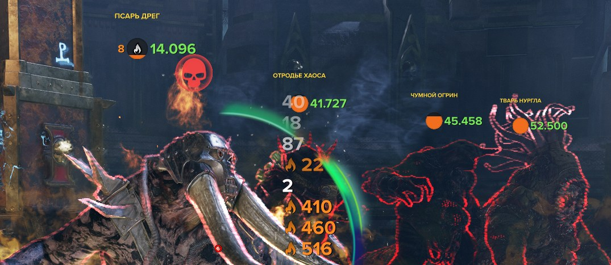

# Auspex Vitals

Enemy health bars for **Warhammer 40,000: Darktide** — with damage-over-time icons, debuffs in percent and your own damage numbers. A mod for the [Darktide Mod Framework](https://www.nexusmods.com/warhammer40kdarktide/mods/8).

[Русское описание — ниже.](#auspex-vitals-по-русски)

## What makes it different

- **Debuffs come from the enemy's real stats, not from a list of known buffs.** The mod reads the same numbers the game uses to calculate damage, so brittleness and extra damage taken from *any* talent or blessing show up — including ones added in future patches. Shown as a percent.
- **Bars don't fade for no reason.** Visibility is checked with the mod's own rays to the enemy's head and chest. The enemy's own gear and the invisible suppression hitbox around other enemies don't count as cover, and the enemy at your crosshair always keeps a full bar.
- **Bounded cost.** Only the nearest enemies get a bar (20 by default), so a horde of hundreds never creates hundreds of widgets.
- **Sphere view.** A compact circle that drains like liquid takes far less room than a bar when enemies stand close together.
- **Three presets and about 40 settings**, grouped by meaning; dependent options appear only when their feature is on.
- **Damage numbers built in**, with effect icons and a feed next to the crosshair.
- **English and Russian.**

## Features

- Health bars per enemy category — horde, elites, specialists, monstrosities and captains. For each: *Always*, *Only wounded*, *Recently damaged*, *Only tagged* or *Off*.
- Two looks: a thin bar with 25/50/75 % ticks and a "ghost" of recent damage, or a sphere.
- Damage over time above the bar: burning, warpfire, bleeding, toxin, electrocution — with stack counts.
- Debuffs in percent: brittleness, extra damage taken (all / melee / ranged), easier stagger. Optional short text labels.
- Void shield of captains; own bar color and name prefix for weakened and empowered bosses.
- Optional health number (size, color, exact or short format, separator) and enemy name (who gets one, size, color, capitals).
- Damage numbers for your own hits: normal, weakspot and critical in different colors, effect ticks with their icon; five styles.
- Bars hide behind walls and fade behind closer enemies; optional fade while aiming down sights.
- Optional: hide the game's boss bar and its damage indicator in the Psykhanium.

## Installation

Requires [Darktide Mod Loader](https://www.nexusmods.com/warhammer40kdarktide/mods/19) and [Darktide Mod Framework](https://www.nexusmods.com/warhammer40kdarktide/mods/8).

1. Download `auspex_vitals-<version>.zip` from [Releases](../../releases).
2. Extract it into `Warhammer 40,000 DARKTIDE\mods` so that you get `mods\auspex_vitals\auspex_vitals.mod`.
3. With [Auto Mod Loading and Ordering](https://www.nexusmods.com/warhammer40kdarktide/mods/246) that is all. Without it, add `auspex_vitals` to `mod_load_order.txt`.

## Compatibility

- **Healthbars**, **Enemies Improved** draw their own bars, so enemies would get two. The mod warns in chat if one of them is enabled — use one at a time.
- **Damage Numbers**: its numbers would mix with ours. Turn off one of the two.
- With *Hide the game's boss bar* on, additions other mods make to that bar disappear with it.

## Not yet

Stagger, attack wind-up indicator, DPS report.

## Feedback

Bugs and crashes — [Issues](../../issues). Please attach the crash GUID or the lines with `[MOD][auspex_vitals]` from the game log (`%APPDATA%\Fatshark\Darktide\console_logs`). Ideas and questions — [Discussions](../../discussions).

## Development

The mod is plain Lua, there is no build step. `dev-link.cmd [path\to\mods]` links the mod folder from the repository into the game's `mods` folder (a junction, no admin rights needed), so edits are picked up on the next game start or mod reload. `python tools/package.py` builds the release archive and checks the files, texts and Lua syntax. How the mod works inside is described in [docs/architecture.md](docs/architecture.md) (in Russian).

Written from scratch on the game's own code; no code from other health bar mods is used.

## License

MIT, see [LICENSE](LICENSE).

---

# Auspex Vitals по-русски

Полосы здоровья врагов для **Warhammer 40,000: Darktide** — со значками периодического урона, дебаффами в процентах и цифрами вашего урона. Мод для [Darktide Mod Framework](https://www.nexusmods.com/warhammer40kdarktide/mods/8).

## Чем отличается

- **Дебаффы берутся из настоящих характеристик врага, а не из списка известных баффов.** Мод читает те же числа, по которым игра считает урон, поэтому хрупкость и повышенный получаемый урон видны от *любого* таланта или благословения — в том числе добавленных будущими патчами. Показываются в процентах.
- **Полосы не гаснут без причины.** Видимость проверяется своими лучами к голове и груди врага. Снаряжение самого врага и невидимая оболочка подавления вокруг соседних врагов помехой не считаются, а у врага в прицеле полоса всегда яркая.
- **Ограниченная нагрузка.** Полосы получают только ближайшие враги (по умолчанию 20), поэтому орда из сотен врагов не создаёт сотни виджетов.
- **Вид «Сфера».** Компактный круг, из которого здоровье утекает, как жидкость, занимает намного меньше места, чем полоса, когда враги стоят плотно.
- **Три пресета и около 40 настроек**, разложенных по смыслу; связанные пункты появляются, только когда включена их функция.
- **Цифры урона встроены**, со значками эффектов и лентой у прицела.
- **Английский и русский.**

## Что умеет

- Полосы здоровья по категориям: орда, элита, специалисты, чудовища и капитаны. Для каждой — *Всегда*, *Только раненые*, *Недавно раненые*, *Только помеченные* или *Выкл*.
- Два вида: тонкая полоса с делениями 25/50/75 % и «призрачным» следом недавнего урона или сфера.
- Периодический урон над полосой: горение, варп-огонь, кровотечение, токсин, электрошок — с числом стаков.
- Дебаффы в процентах: хрупкость брони, повышенный получаемый урон (весь / в ближнем бою / от стрельбы), лёгкость ошеломления. По желанию — короткие подписи.
- Щит пустоты капитанов; свой цвет полосы и приставка к имени у ослабленных и усиленных боссов.
- По желанию — число здоровья (размер, цвет, точно или сокращённо, разделитель) и имя врага (кому показывать, размер, цвет, заглавные).
- Цифры вашего урона: обычный, слабое место и крит — разными цветами, тики эффектов со значком; пять стилей.
- Полосы скрываются за стенами и гаснут за ближними врагами; по желанию приглушаются при прицеливании.
- По желанию — скрыть стандартную полосу босса и индикатор урона в Психаниуме.

## Установка

Нужны [Darktide Mod Loader](https://www.nexusmods.com/warhammer40kdarktide/mods/19) и [Darktide Mod Framework](https://www.nexusmods.com/warhammer40kdarktide/mods/8).

1. Скачайте `auspex_vitals-<версия>.zip` со страницы [Releases](../../releases).
2. Распакуйте в `Warhammer 40,000 DARKTIDE\mods`, чтобы получилось `mods\auspex_vitals\auspex_vitals.mod`.
3. С [Auto Mod Loading and Ordering](https://www.nexusmods.com/warhammer40kdarktide/mods/246) больше ничего не нужно. Без него впишите `auspex_vitals` в `mod_load_order.txt`.

## Совместимость

- **Healthbars**, **Enemies Improved** рисуют свои полосы, у врагов будет две. Если один из них включён, мод предупредит в чате — оставьте один.
- **Damage Numbers** — его цифры смешаются с нашими. Выключите что-то одно.
- При включённой настройке «Скрывать полосу босса игры» вместе с ней пропадают и добавки других модов к этой полосе.

## Пока нет

Ошеломление, индикатор замаха, отчёт DPS.

## Обратная связь

Ошибки и падения — в [Issues](../../issues). Приложите GUID падения или строки с `[MOD][auspex_vitals]` из лога игры (`%APPDATA%\Fatshark\Darktide\console_logs`). Идеи и вопросы — в [Discussions](../../discussions).

## Разработка

Мод — обычные Lua-файлы, сборки нет. `dev-link.cmd [путь\к\mods]` подключает папку мода из репозитория к папке `mods` игры ссылкой (junction, права администратора не нужны): правки видны после перезапуска игры или перезагрузки модов. `python tools/package.py` собирает архив релиза и проверяет файлы, тексты и синтаксис Lua. Устройство мода описано в [docs/architecture.md](docs/architecture.md).

Написан с нуля по коду самой игры; код других модов с полосами здоровья не используется.

## Лицензия

MIT, см. [LICENSE](LICENSE).
